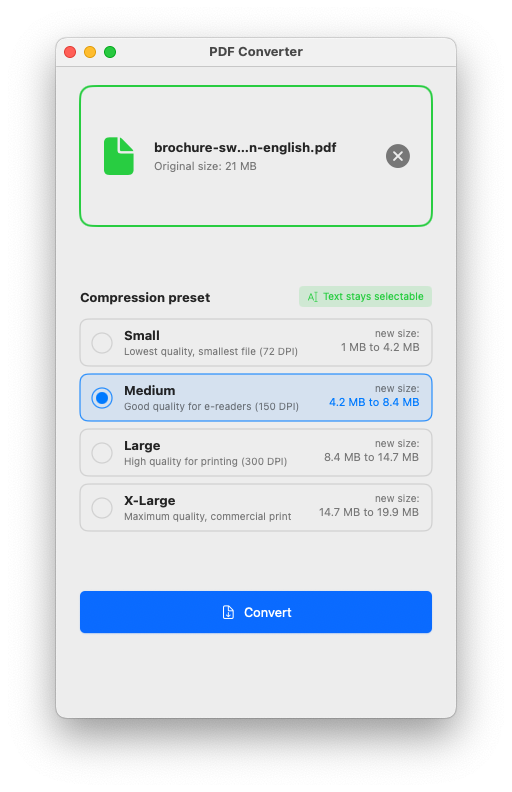

# PDFConverter

A cross-platform PDF compression utility that reduces PDF file sizes while preserving text selectability. Available for macOS and Windows.

## What's New in v2.0

- **Ghostscript-powered compression** - Industry-standard PDF optimization
- **Text stays selectable** - No more rasterization; vectors and text preserved
- **Better compression ratios** - Up to 90% file size reduction
- **Estimated size preview** - See projected file size before converting



## Features

- **Drag-and-drop** PDF file handling
- **Four compression presets** with different quality/size tradeoffs:
  - **Small** (72 DPI) - Smallest file, for on-screen viewing
  - **Medium** (150 DPI) - Good quality for e-readers
  - **Large** (300 DPI) - High quality for printing
  - **X-Large** - Maximum quality for commercial print
- Text remains searchable and selectable after compression
- Estimated output size shown for each preset
- Automatic file naming with preset suffix (e.g., `document-medium-150dpi.pdf`)

## Requirements

### macOS
- macOS 13.0 or later
- Ghostscript (bundled in app, or install via `brew install ghostscript`)

### Windows
- Windows 10 (build 17763.0) or later
- .NET 7.0 Runtime

## Installation

### macOS

Download the latest DMG from the [Releases](https://github.com/demedlher/PDFConverter/releases) page, open it, and drag PDFConverter to your Applications folder.

Or build from source:

```bash
# Install Ghostscript (required for bundling)
brew install ghostscript

# Clone and build
git clone https://github.com/demedlher/PDFConverter.git
cd PDFConverter
./build_app.sh
```

### Windows

Build from source using Visual Studio 2022 or the command line:

```bash
cd PDFConverter.Windows
dotnet build
dotnet run
```

## Usage

1. Launch PDFConverter
2. Drag and drop a PDF file onto the drop zone
3. Select your desired compression preset
4. The compressed PDF will be saved in the same directory with a preset suffix

## Compression Comparison

| Preset | Typical Reduction | Best For |
|--------|-------------------|----------|
| Screen | 80-90% | Email attachments, web viewing |
| E-book | 60-70% | E-readers, tablets |
| Printer | 40-50% | Office printing |
| Prepress | 10-20% | Professional printing |

## Project Structure

```
PDFConverter/
├── Sources/PDFConverter/          # macOS Swift implementation
│   ├── PDFConverterApp.swift      # App entry point
│   ├── ContentView.swift          # Main UI
│   ├── PDFConverterViewModel.swift # Conversion orchestration
│   └── GhostscriptService.swift   # Ghostscript wrapper
├── PDFConverter.Windows/          # Windows C# implementation
├── Package.swift                  # Swift package manifest
├── build_app.sh                   # macOS app bundle builder
├── bundle_ghostscript.sh          # Ghostscript bundling script
├── create_dmg.sh                  # DMG installer creator
└── create_icon.sh                 # App icon generator
```

## Tech Stack

### macOS (v2.0)
- **Language**: Swift 5.9+
- **Framework**: SwiftUI
- **PDF Processing**: Ghostscript (bundled)
- **Minimum OS**: macOS 13.0

### Windows
- **Language**: C# (.NET 7.0)
- **Framework**: WinUI 3 / Windows App SDK 1.4
- **PDF Processing**: PdfSharp 1.50.5147

## How It Works

v2.0 uses Ghostscript's PDF optimization engine which:
- Downsamples images to target DPI
- Compresses embedded fonts
- Removes unused objects
- Preserves text, vectors, and document structure

Unlike v1.0's rasterization approach, text remains fully selectable and searchable.

## Building from Source

### macOS

```bash
# Prerequisites
brew install ghostscript

# Build
swift build -c release

# Create app bundle with bundled Ghostscript
./build_app.sh
```

### Windows

```bash
cd PDFConverter.Windows
dotnet restore
dotnet build -c Release
```

## License

- **PDFConverter**: MIT License - see [LICENSE](LICENSE)
- **Ghostscript**: AGPL-3.0 - see [Ghostscript licensing](https://www.ghostscript.com/licensing/)

## Author

Demed ([@demedlher](https://github.com/demedlher))
