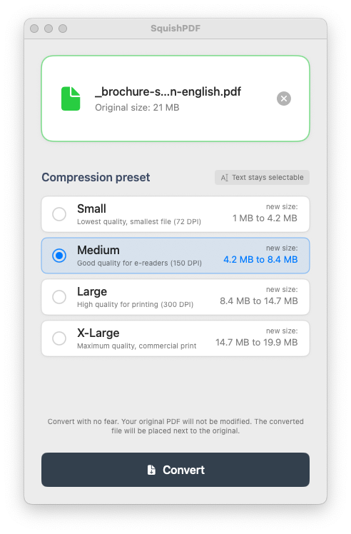
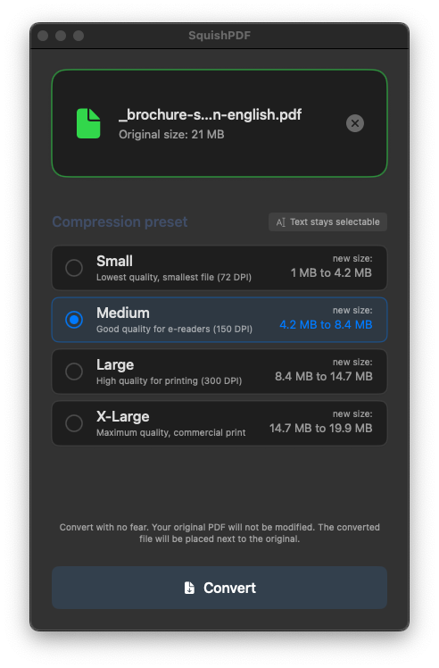

# SquishPDF

Simple, no-frills, yet highly effective PDF compression for macOS. Drop the file, select the compression level, convert — done. No sprawling settings. No confusing menus. Just results.

## What's New in v2.7

- **Renamed to SquishPDF** - Fresh identity, same great compression
- **Ghostscript-powered compression** - Industry-standard PDF optimization
- **Text stays selectable** - No more rasterization; vectors and text preserved
- **Better compression ratios** - Up to 90% file size reduction
- **Estimated size preview** - See projected file size before converting
- **Design tokens** - Bauhaus-inspired UI with 8-point grid and modular typography
- **Light & Dark mode** - Native macOS appearance support

| Light Mode | Dark Mode |
|:----------:|:---------:|
|  |  |

## Features

- **Drag-and-drop** PDF file handling
- **Four compression presets** with different quality/size tradeoffs:
  - **Small** (72 DPI) - Smallest file, for on-screen viewing
  - **Medium** (150 DPI) - Good quality for e-readers
  - **Large** (300 DPI) - High quality for printing
  - **X-Large** - Maximum quality for commercial print
- Text remains searchable and selectable after compression
- Estimated output size shown for each preset
- Automatic file naming with preset suffix (e.g., `document-medium-150dpi.pdf`)

## Requirements

### macOS
- macOS 13.0 or later
- Ghostscript (bundled in app, or install via `brew install ghostscript`)

## Installation

### macOS

Download the latest DMG from the [Releases](https://github.com/demedlher/SquishPDF/releases) page, open it, and drag SquishPDF to your Applications folder.

> **macOS Security Notice**: This app is not signed with an Apple Developer certificate, so macOS will quarantine it by default. If you trust this app, remove the quarantine attribute by running:
> ```bash
> xattr -cr /Applications/SquishPDF.app
> ```

Or build from source:

```bash
# Install Ghostscript (required for bundling)
brew install ghostscript

# Clone and build
git clone https://github.com/demedlher/SquishPDF.git
cd SquishPDF
./build_app.sh
```

## Usage

1. Launch SquishPDF
2. Drag and drop a PDF file onto the drop zone
3. Select your desired compression preset
4. Click Convert
5. The compressed PDF will be saved in the same directory with a preset suffix

## Compression Comparison

| Preset | Typical Reduction | Best For |
|--------|-------------------|----------|
| Small | 80-90% | Email attachments, web viewing |
| Medium | 60-70% | E-readers, tablets |
| Large | 40-50% | Office printing |
| X-Large | 10-20% | Professional printing |

## Project Structure

```
SquishPDF/
├── Sources/SquishPDF/             # macOS Swift implementation
│   ├── SquishPDFApp.swift         # App entry point
│   ├── ContentView.swift          # Main UI
│   ├── SquishPDFViewModel.swift   # Conversion orchestration
│   ├── GhostscriptService.swift   # Ghostscript wrapper
│   └── DesignTokens.swift         # UI design system
├── Package.swift                  # Swift package manifest
├── build_app.sh                   # macOS app bundle builder
├── bundle_ghostscript.sh          # Ghostscript bundling script
├── create_dmg.sh                  # DMG installer creator
└── create_icon.sh                 # App icon generator
```

## Tech Stack

### macOS (v2.7)
- **Language**: Swift 5.9+
- **Framework**: SwiftUI
- **PDF Processing**: Ghostscript (bundled)
- **Minimum OS**: macOS 13.0

## How It Works

SquishPDF uses Ghostscript's PDF optimization engine which:
- Downsamples images to target DPI
- Compresses embedded fonts
- Removes unused objects
- Preserves text, vectors, and document structure

Unlike rasterization approaches, text remains fully selectable and searchable.

## Building from Source

### macOS

```bash
# Prerequisites
brew install ghostscript

# Build
swift build -c release

# Create app bundle with bundled Ghostscript
./build_app.sh
```

## License

**AGPL-3.0** - see [LICENSE](LICENSE)

This application bundles Ghostscript, also licensed under AGPL-3.0.

## Author

Demed L'Her ([@demedlher](https://github.com/demedlher))
