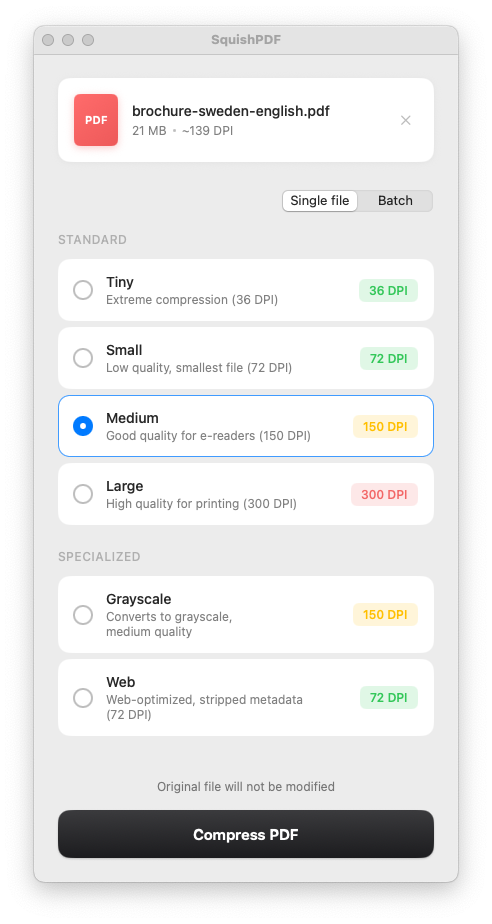
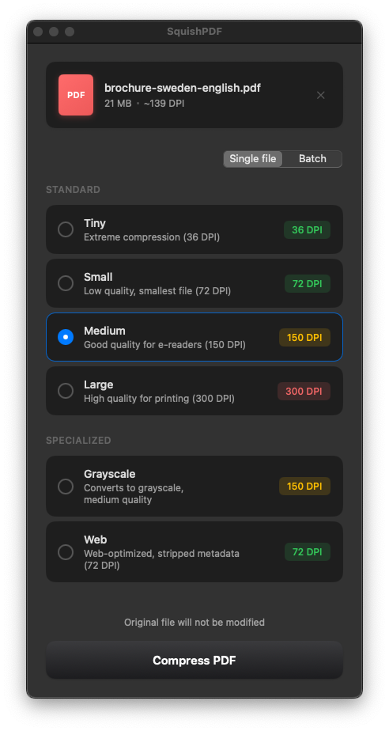

# SquishPDF

Simple, no-frills, yet highly effective PDF compression for macOS. Drop the file, select the compression level, convert — done. No sprawling settings. No confusing menus. Just results.

## What's New in v4.0

- **Redesigned UI** - Clean, modern interface with improved visual hierarchy
- **Native compression engine** - New Apple-native compression option (no external dependencies) for App Store compatibility
- **Specialized presets** - Grayscale and Web-optimized compression options
- **Single/Batch mode toggle** - Switch between single file and batch processing with a segmented control
- **Effectiveness indicators** - Color-coded DPI badges show compression potential (green = will compress, yellow = might compress, red = unlikely)
- **Hover tooltips** - Hover over presets to see compression guidance

| Light Mode | Dark Mode |
|:----------:|:---------:|
|  |  |

## Features

- **Drag-and-drop** PDF file handling
- **Six compression presets** with different quality/size tradeoffs:
  - **Tiny** (36 DPI) - Extreme compression, maximum size reduction
  - **Small** (72 DPI) - Smallest file, for on-screen viewing
  - **Medium** (150 DPI) - Good quality for e-readers
  - **Large** (300 DPI) - High quality for printing
  - **Grayscale** (150 DPI) - Converts to grayscale while compressing
  - **Web** (72 DPI) - Web-optimized with stripped metadata
- **Smart PDF analysis** - Detects image DPI and shows quality assessment
- **Color-coded effectiveness** - DPI badges change color based on compression potential
- **Single/Batch mode** - Process one file or multiple files with multiple presets
- Automatic file naming with preset suffix (e.g., `document-medium-150dpi.pdf`)

## Who is this app for?

- **Office professionals** (marketing, sales, HR, finance) tired of emailing 50 MB PDFs
- **Anyone frustrated** with Preview's "Reduce File Size" producing barely-smaller files
- **Users who've tried** Adobe Acrobat, Office export options, or online compressors — and found them lacking
- **People who need** to meet upload size limits for portals, forms, or email attachments
- **Mac users who want** a native, offline solution that just works — no subscriptions, no uploads to sketchy websites

If you've ever wondered why your 80-page presentation is still 45 MB after "compressing" it, SquishPDF is for you.

## Requirements

### macOS
- macOS 13.0 or later
- Native version: No additional dependencies
- Ghostscript version: Ghostscript (bundled in app, or install via `brew install ghostscript`)

## Installation

### macOS

Download from the [Releases](https://github.com/demedlher/SquishPDF/releases) page:

| Installer | Size | Description |
|-----------|------|-------------|
| `SquishPDF_v4.0_Full.dmg` | ~22 MB | Includes Ghostscript — text remains selectable |
| `SquishPDF_v4.0_Lean.dmg` | ~3 MB | Requires `brew install ghostscript` first |

Open the DMG and drag SquishPDF to your Applications folder.

> **macOS Security Notice**: This app is not signed with an Apple Developer certificate, so macOS will quarantine it by default. If you trust this app, remove the quarantine attribute by running:
> ```bash
> xattr -cr /Applications/SquishPDF.app
> ```

Or build from source:

```bash
# Install Ghostscript (required for bundling)
brew install ghostscript

# Clone and build
git clone https://github.com/demedlher/SquishPDF.git
cd SquishPDF
./build_app.sh
```

## Usage

1. Launch SquishPDF
2. Drag and drop a PDF file onto the drop zone
3. Select your desired compression preset (color indicates effectiveness)
4. Click "Compress PDF"
5. The compressed PDF will be saved in the same directory with a preset suffix

## Compression Comparison

| Preset | Typical Reduction | Best For |
|--------|-------------------|----------|
| Tiny | 90-98% | Maximum compression, low quality acceptable |
| Small | 80-95% | Email attachments, web viewing |
| Medium | 60-80% | E-readers, tablets |
| Large | 30-60% | Office printing |
| Grayscale | 50-70% | Graphics-heavy docs where color isn't needed |
| Web | 80-95% | Web publishing, fast loading |

## Project Structure

```
SquishPDF/
├── Sources/SquishPDF/             # macOS Swift implementation
│   ├── SquishPDFApp.swift         # App entry point
│   ├── ContentView.swift          # Main UI
│   ├── SquishPDFViewModel.swift   # Conversion orchestration
│   ├── GhostscriptService.swift   # Ghostscript wrapper
│   └── Compression/               # Compression engines
│       ├── CompressionEngine.swift
│       ├── GhostscriptEngine.swift
│       └── NativeEngine/          # Apple-native compression
├── Package.swift                  # Swift package manifest
├── build_app.sh                   # macOS app bundle builder (--with-gs/--no-gs)
├── build_both.sh                  # Builds both Full and Lean installers
├── bundle_ghostscript.sh          # Ghostscript bundling script
├── create_dmg.sh                  # DMG installer creator
└── create_icon.sh                 # App icon generator
```

## Tech Stack

### macOS (v4.0)
- **Language**: Swift 5.9+
- **Framework**: SwiftUI
- **PDF Processing**: Native (CoreGraphics/PDFKit) or Ghostscript
- **Minimum OS**: macOS 13.0

## How It Works

SquishPDF offers two compression engines:

**Native Engine** (v4.0): Uses Apple's CoreGraphics and PDFKit to rasterize and recompress PDF pages. Fast and dependency-free, but text becomes non-selectable.

**Ghostscript Engine**: Uses Ghostscript's PDF optimization which downsamples images, compresses fonts, and removes unused objects while preserving text selectability.

## Building from Source

### macOS

```bash
# Prerequisites
brew install ghostscript

# Build both installers (Full + Lean)
./build_both.sh

# Or build individually:
./build_app.sh --with-gs   # Full version with Ghostscript (~22 MB)
./build_app.sh --no-gs     # Lean version without Ghostscript (~3 MB)
```

## License

**AGPL-3.0** - see [LICENSE](LICENSE)

This application bundles Ghostscript, also licensed under AGPL-3.0.

## Author

Demed L'Her ([@demedlher](https://github.com/demedlher))
